# 👋 Hi, I'm Tomás Alegre Sepúlveda

I've been part of the GitHub community for 7 years, with 5 years of more active involvement, focusing on creating scalable and efficient solutions. I'm now looking to contribute more to the developer community and open-source projects.

## 🔧 Technologies

I work with:

- **JavaScript** & **TypeScript**: Building dynamic web applications.
- **Docker**: Containerization and efficient deployment.
- **NestJS** & **NextJS**: Full-stack development.
- **Angular**: Interactive user interfaces.
- **Go**: A backend language I'm just starting to explore.

## 🎯 Mission

I aim to create maintainable, scalable, and high-quality software while collaborating and contributing to the community.

## 🌍 Community Contributions

I'm passionate about contributing to open-source projects and sharing my knowledge with other developers. I'm always on the lookout for new opportunities to contribute and learn.

## 🚀 My Development Stats

